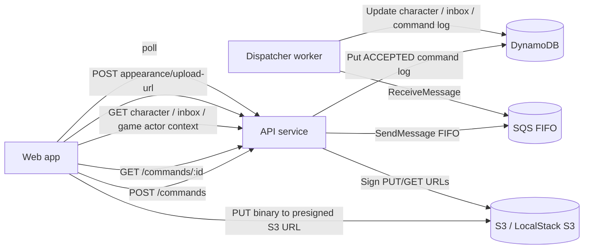

# Monorepo Architecture Review

## Scope

This review is based on the implemented code in `packages/web`, `packages/services/api`, `packages/services/dispatcher`, `packages/services/shared`, `packages/shared`, and `packages/engine` as of March 8, 2026.

## What The Monorepo Implements

The repo currently implements a command-driven character creation vertical slice for Sword World:

- `packages/web`
  - Browser UI for login, character wizard, character sheet, player inbox, GM inbox, and demo command submission.
  - The wizard currently orchestrates a full end-to-end submit sequence from the browser, with identity persisted at final submit.
- `packages/services/api`
  - Thin HTTP layer for command acceptance, read endpoints, game actor context, and appearance upload URL issuance.
  - Writes accepted commands to the command log and enqueues them to SQS FIFO.
- `packages/services/dispatcher`
  - Worker that consumes commands from SQS, applies domain handlers, writes DynamoDB state, and records inbox effects.
- `packages/services/shared`
  - DynamoDB repositories, queue abstractions, authorization helpers, and shared service utilities.
- `packages/shared`
  - Shared schemas, command contracts, DynamoDB item contracts, fixture loading, and auth helpers.
- `packages/engine`
  - Pure character-creation rule logic for abilities, starting package application, EXP spend, equipment validation, finalization, and submit-for-approval.

## Runtime Architecture

## Bounded Responsibilities

- Web owns user interaction, browser auth state, command submission, polling, and page-local orchestration.
- API owns request validation, actor resolution, command acceptance, command enqueue, read models, GM authorization on HTTP reads, presigned appearance upload issuance, and signed image read URLs.
- Dispatcher owns command application, inbox effects, GM authorization on review commands, and character state transitions.
- Engine owns pure rule enforcement. It is not aware of HTTP, queues, or persistence.
- DynamoDB is used as both write model and read model for this slice.

## Data Model Summary

- `GameState` table stores:
  - `Character`
  - `GMInboxItem`
  - `PlayerInboxItem`
  - `GameMetadata`
  - `PlayerProfile`
- `CommandLog` table stores:
  - `Command`

Important identifiers for debugging:

- `commandId`: correlation key for async command flow.
- `gameId`: queue group and partitioning determinant.
- `characterId`: primary character aggregate key.
- `actorId`: resolved caller identity.
- `version`: optimistic locking determinant on `Character`.

## Implemented Product Functions

- Auth:
  - Dev bypass auth.
  - OIDC login redirect and callback completion.
- Character creation commands:
  - `CreateCharacterDraft`
  - `SetCharacterSubAbilities`
  - `ApplyStartingPackage`
  - `SpendStartingExp`
  - `PurchaseStarterEquipment`
  - `ConfirmCharacterAppearanceUpload`
  - `SubmitCharacterForApproval`
  - `GMReviewCharacter`
- Reads:
  - `GET /commands/{commandId}`
  - `GET /games/{gameId}/me`
  - `GET /games/{gameId}/characters/{characterId}`
  - `GET /me/inbox`
  - `GET /gm/{gameId}/inbox`
- Appearance upload:
  - request upload URL
  - direct binary PUT to object storage
  - async confirm command

## Observability Review

### What Is Good

- The slice already had a useful command log model with explicit `ACCEPTED`, `PROCESSING`, `PROCESSED`, and `FAILED`.
- Deterministic identifiers already exist in the contracts.
- Dispatcher effects are isolated enough to summarize cleanly in logs.

### What Changed

- Added structured browser flow logging in the web app.
- Added richer command summaries to API and dispatcher logs.
- Added route-specific API rejection logs for upload and command acceptance failure modes.
- Added delete-after-fail dispatcher behavior with explicit failure deletion logs.
- Fixed dev-mode actor resolution so `POST /commands` now matches the documented fallback behavior when `bypassActorId` is omitted.
- Persisted identity and `noteToGm` on final character submission.
- Enforced GM authorization on GM inbox reads and GM review command submission/dispatch.
- Added idempotent duplicate `commandId` acceptance behavior at the API edge.
- Moved appearance mutation into the async command pipeline and replaced in-memory upload sessions with presigned object-storage URLs.

## Architectural Findings

### Resolved In Current Workspace Changes

1. Identity is now persisted on final submit.
2. `noteToGm` is now stored on the character draft.
3. GM authorization is now enforced on GM inbox reads and GM review commands.
4. Failed dispatcher messages are now deleted after `FAILED`, while structured logs preserve the root cause.
5. Duplicate `commandId` acceptance is now idempotent, returning existing command status and replay-enqueueing only still-`ACCEPTED` commands.
6. Appearance upload now joins the command pipeline: storage upload is direct to S3, state mutation happens through `ConfirmCharacterAppearanceUpload`.

### Remaining Findings

1. Client-supplied timestamps are trusted as write timestamps.
   - `createdAt` on commands is generated by the browser and reused downstream.
   - This is acceptable for a local slice but weak for authoritative auditing.

2. GM inbox item resolution is character-based, not submission-instance-based.
   - The review handler queries the inbox and selects the first row for that `characterId`.
   - If the same character were resubmitted multiple times, the wrong pending row could be removed.

3. The character wizard runs the whole command chain on final submit.
   - The UI is visually step-based, but the backend state only changes during the final orchestration.
   - That makes partial-save debugging less direct than the screen flow suggests.

4. Signed image URLs are generated on read and are intentionally short-lived.
   - This is the right storage model for the slice.
   - It does mean copied URLs expire and should not be treated as durable references.

## Next Steps To Complete The Character Creation Vertical Slice

1. Persist identity earlier in the wizard if partial-save behavior is desired instead of waiting for final submit.
2. Expose `noteToGm` more directly in the GM review UI instead of only storing it on the character.
3. Add a read model or endpoint for GM review detail so a GM can inspect the submitted character without reconstructing context manually.
4. Make submission-instance resolution explicit in the GM inbox workflow instead of deleting the first matching pending row by `characterId`.
5. Replace client-authored audit timestamps with server-authored timestamps if the slice needs trustworthy operational audit trails.

## Debugging Docs

- [debugging.function-index.md](/workspaces/hello-world-monorepo/docs/debugging.function-index.md)
- [debugging.auth-and-home.md](/workspaces/hello-world-monorepo/docs/debugging.auth-and-home.md)
- [debugging.character-creation.md](/workspaces/hello-world-monorepo/docs/debugging.character-creation.md)
- [debugging.character-sheet-and-review.md](/workspaces/hello-world-monorepo/docs/debugging.character-sheet-and-review.md)
