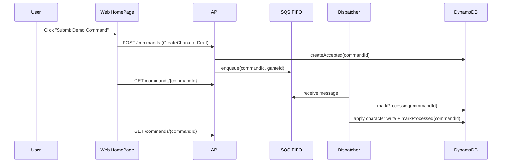
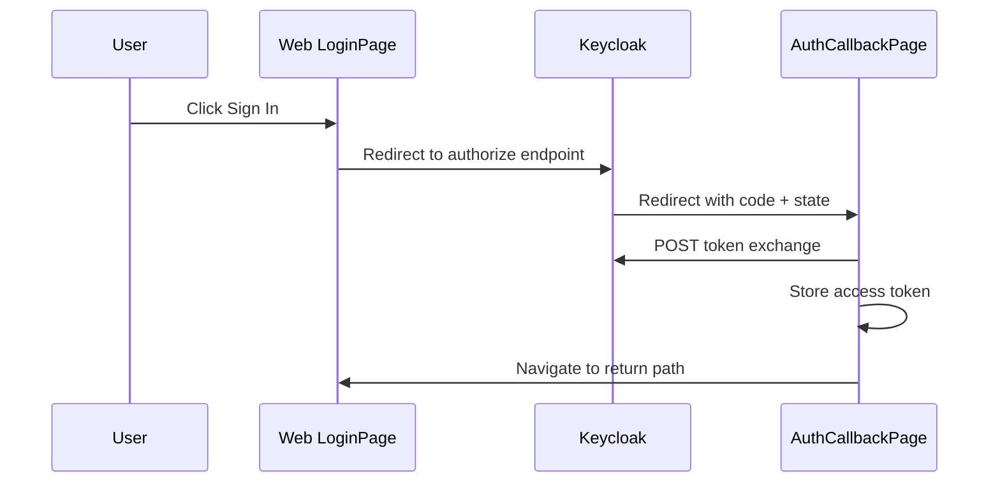

# Debugging Guide: Auth And Home

## Log Toggles

- Web:
  - enabled in Vite dev by default
  - or set `VITE_FLOW_LOG=1`
- API and dispatcher:
  - set `FLOW_LOG=1`

## Home Demo Submit

### Sequence

### Normal Logs

- Web
  - `WEB_HOME_DEMO_SUBMIT_START`
  - `WEB_HOME_DEMO_SUBMIT_ACCEPTED`
  - `WEB_API_POST_COMMAND_REQUEST`
  - `WEB_API_POST_COMMAND_ACCEPTED`
  - `WEB_API_GET_COMMAND_STATUS_REQUEST`
  - `WEB_API_GET_COMMAND_STATUS_HIT`
- API
  - `API_REQUEST_START`
  - `API_POST_COMMAND_REQUEST`
  - `API_ACTOR_RESOLVED`
  - `API_VALIDATE_ENVELOPE`
  - `API_COMMANDLOG_ACCEPTED`
  - `API_ENQUEUED`
  - `API_POST_COMMAND_ACCEPTED`
  - `API_GET_COMMAND_STATUS_HIT`
- Dispatcher
  - `DISPATCHER_RECEIVE_BATCH`
  - `DISPATCHER_MESSAGE_RECEIVED`
  - `DISPATCH_BEGIN`
  - `DISPATCH_MARK_PROCESSING`
  - `DISPATCH_HANDLER_EFFECTS`
  - `DISPATCH_APPLY_EFFECTS_OK`
  - `DISPATCHER_MESSAGE_RESULT`
  - `DISPATCHER_MESSAGE_DELETED`

### Error Logs

- Web
  - `WEB_HOME_DEMO_SUBMIT_FAILED`
  - `WEB_API_REQUEST_ERROR`
- API
  - `API_POST_COMMAND_REJECTED`
  - `API_COMMANDLOG_ACCEPT_FAILED`
  - `API_ENQUEUE_FAILED`
  - `API_REQUEST_ERROR`
- Dispatcher
  - `DISPATCH_FAILED`
  - `DISPATCHER_MESSAGE_DELETED_AFTER_FAILURE`
  - `DISPATCHER_LOOP_ERROR`

## Dev Auth

### Behavior

- `createDevAuthProvider` injects `bypassActorId` on command POSTs in dev mode.
- API `resolveActorId` now falls back to:
  - `bypassActorId`
  - `DEV_ACTOR_ID`
  - `player-aaa`

### Key Determinants

- `actorId`
- `authMode`
- `bypassActorIdProvided`

### Normal Logs

- Web API logs include `actorId` and `authMode`
- API logs include `API_ACTOR_RESOLVED`

## OIDC Login

### Sequence

### Normal Logs

- `WEB_LOGIN_START`
- `WEB_AUTH_CALLBACK_START`
- `WEB_AUTH_CALLBACK_OK`

### Error Logs

- `WEB_LOGIN_FAILED`
- `WEB_AUTH_CALLBACK_FAILED`

### Determinants To Capture

- `authMode`
- `returnToPath`
- browser network failure or token exchange error text

## Fast Triage

- If the browser never gets a `commandId`, start with `WEB_API_POST_COMMAND_REQUEST` and `API_POST_COMMAND_REQUEST`.
- If the browser sees `ACCEPTED` forever, compare `API_ENQUEUED` against `DISPATCHER_MESSAGE_RECEIVED`.
- If OIDC appears broken before API traffic exists, ignore backend logs and start from `WEB_LOGIN_*` and `WEB_AUTH_CALLBACK_*`.
