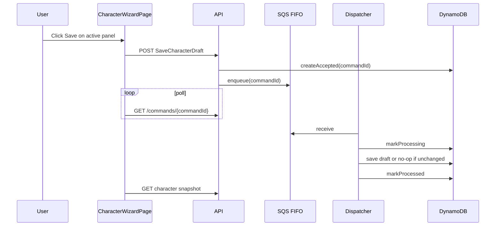
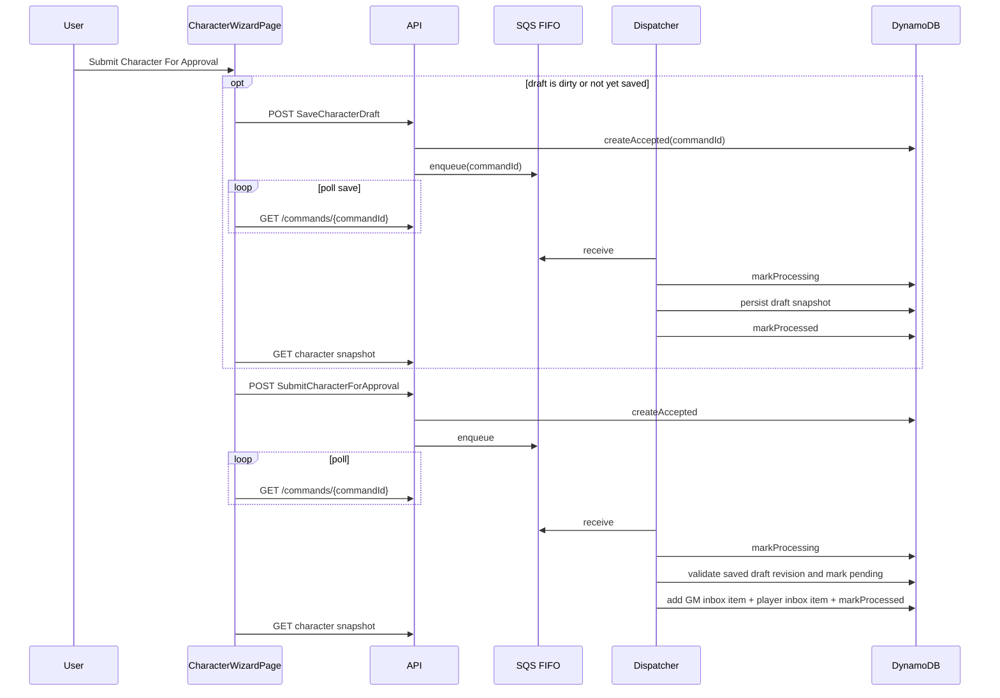

# Debugging Guide: Character Creation

## Correlation Keys

Always capture these first:

- `commandId`
- `gameId`
- `characterId`
- `actorId`
- `type`

For wizard orchestration also capture:

- `label` from `WEB_CHARACTER_WIZARD_STEP_SUBMIT_*`
- `stepKey` from `WEB_CHARACTER_WIZARD_SAVE_*`
- `status` from command polling

## Panel Save

### Sequence

### Normal Web Logs

- `WEB_CHARACTER_WIZARD_SAVE_START`
- `WEB_CHARACTER_WIZARD_SAVE_PAYLOAD_BUILT`
- `WEB_CHARACTER_WIZARD_SAVE_ACCEPTED`
- `WEB_CHARACTER_WIZARD_STATUS_POLLED`
- `WEB_CHARACTER_WIZARD_SNAPSHOT_REFRESH_OK`
- `WEB_CHARACTER_WIZARD_SAVE_OK`

### Normal API / Dispatcher Logs

- `API_POST_COMMAND_REQUEST`
- `API_ACTOR_RESOLVED`
- `API_VALIDATE_ENVELOPE`
- `API_COMMANDLOG_ACCEPTED`
- `API_ENQUEUED`
- `DISPATCH_BEGIN`
- `DISPATCH_MARK_PROCESSING`
- `DISPATCH_HANDLER_EFFECTS`
- `DISPATCH_APPLY_EFFECTS_OK`
- `DISPATCHER_MESSAGE_DELETED`

### Save Error Logs

- Web
  - `WEB_CHARACTER_WIZARD_SAVE_FAILED`
  - `WEB_API_REQUEST_ERROR`
- API
  - `API_POST_COMMAND_REJECTED`
  - `API_COMMANDLOG_ACCEPT_FAILED`
  - `API_ENQUEUE_FAILED`
  - `API_REQUEST_ERROR`
- Dispatcher
  - `DISPATCH_FAILED`
  - `DISPATCHER_MESSAGE_DELETED_AFTER_FAILURE`

### Idempotency Expectation

- Re-saving the same wizard snapshot should leave the character draft unchanged.
- A successful no-op save still emits the normal command acceptance and processing logs, but the handler effects should show zero writes.

## Command: SaveCharacterDraft

### Determinants

- `expectedVersion`
- `race`
- `raisedBy`
- `subAbility`
- `backgroundRoll2dTotal`
- `startingMoneyRoll2dTotal`
- `identity`
- `purchases`
- `cart`
- `noteToGmPresent`

### Expected Success Shape

- character row exists with `status=DRAFT` or `status=REJECTED`
- draft snapshot is fully replaced from the saved payload
- derived `ability`, `skills`, and starting package fields are recomputed server-side
- `version` increments only when the effective draft changes

### Common Failure Codes

- `STALE_CHARACTER_VERSION`
- `CHARACTER_OWNER_REQUIRED`
- `CHARACTER_NOT_EDITABLE`
- engine validation failures such as `EXP_INSUFFICIENT`

### Triage

- Compare `expectedVersion` in `API_POST_COMMAND_REQUEST` with the current character `version`.
- Use `DISPATCH_HANDLER_EFFECTS` to confirm whether the save produced writes or a no-op.
- If save fails on a pending or approved character, expect `CHARACTER_NOT_EDITABLE`.

## Submit Saved Draft For Review

### Sequence

### Normal Web Logs

- `WEB_CHARACTER_WIZARD_EXECUTE_START`
- optional when submit auto-saves first:
  - `WEB_CHARACTER_WIZARD_SAVE_START`
  - `WEB_CHARACTER_WIZARD_SAVE_ACCEPTED`
  - `WEB_CHARACTER_WIZARD_SAVE_OK`
- `WEB_CHARACTER_WIZARD_STEP_SUBMIT_START`
- `WEB_CHARACTER_WIZARD_STEP_SUBMIT_ACCEPTED`
- `WEB_CHARACTER_WIZARD_STATUS_POLLED`
- `WEB_CHARACTER_WIZARD_STEP_SUBMIT_OK`
- `WEB_CHARACTER_WIZARD_SNAPSHOT_REFRESH_OK`
- `WEB_CHARACTER_WIZARD_EXECUTE_OK`

### Normal API / Dispatcher Logs

- `API_POST_COMMAND_REQUEST`
- `API_ACTOR_RESOLVED`
- `API_VALIDATE_ENVELOPE`
- `API_COMMANDLOG_ACCEPTED`
- `API_ENQUEUED`
- `DISPATCH_BEGIN`
- `DISPATCH_MARK_PROCESSING`
- `DISPATCH_HANDLER_EFFECTS`
- `DISPATCH_APPLY_EFFECTS_OK`
- `DISPATCHER_MESSAGE_DELETED`

### Wizard Error Logs

- Web
  - `WEB_CHARACTER_WIZARD_STEP_SUBMIT_FAILED`
  - `WEB_CHARACTER_WIZARD_EXECUTE_FAILED`
  - `WEB_API_REQUEST_ERROR`
- API
  - `API_POST_COMMAND_REJECTED`
  - `API_COMMANDLOG_ACCEPT_FAILED`
  - `API_ENQUEUE_FAILED`
  - `API_REQUEST_ERROR`
- Dispatcher
  - `DISPATCH_FAILED`
  - `DISPATCHER_MESSAGE_DELETED_AFTER_FAILURE`

## Command: CreateCharacterDraft

### Determinants

- `race`
- `raisedBy`

### Expected Success Shape

- Character row created with:
  - `status=DRAFT`
  - `version=1`
  - zeroed sub-ability / ability / bonus

### Common Failure

- `CHARACTER_ID_ALREADY_EXISTS`

### Triage

- If API accepted but dispatch fails, inspect `DISPATCH_FAILED` for `CHARACTER_ID_ALREADY_EXISTS`.
- If the wizard unexpectedly skips this step, inspect `WEB_API_GET_CHARACTER_HIT` before submit.

## Command: SetCharacterSubAbilities

### Determinants

- `subAbility`

### Expected Success Shape

- Derived `ability` and `bonus` are written back to the draft.
- Character version increments by 1.

### Common Failure

- `character not found: {gameId}/{characterId}`
- optimistic-lock failure from concurrent updates

### Triage

- Compare `subAbility` in `API_POST_COMMAND_REQUEST` and `DISPATCH_BEGIN`.
- Confirm `nextStatus` in `DISPATCH_HANDLER_EFFECTS` remains `DRAFT`.

## Command: ApplyStartingPackage

### Determinants

- `backgroundRoll2dTotal`
- `startingMoneyRoll2dTotal`
- `useOrdinaryCitizenShortcut`
- `race`
- `raisedBy`

### Expected Success Shape

- `starting.expTotal`
- `starting.expUnspent`
- `starting.moneyGamels`
- `skills`

### Common Failure Codes

- `MISSING_RACE`
- `MISSING_BACKGROUND_ROLL`

### Triage

- For humans and half-elves raised by humans, verify the background roll is present.
- For dwarf path, verify the race-specific branch is expected.

## Command: SpendStartingExp

### Determinants

- `purchases`

### Expected Success Shape

- updated `skills`
- reduced `starting.expUnspent`

### Common Failure Codes

- `EXP_INSUFFICIENT`
- `SORCERER_SAGE_BUNDLE_REQUIRED`

### Triage

- Inspect `purchases` in `API_POST_COMMAND_REQUEST`.
- On failure, expect `DISPATCH_FAILED` followed by `DISPATCHER_MESSAGE_DELETED_AFTER_FAILURE`.

## Command: PurchaseStarterEquipment

### Determinants

- `cartWeapons`
- `cartArmor`
- `cartShields`
- `cartGear`

### Expected Success Shape

- `draft.purchases` populated from fixture catalog

### Common Failure Codes

- `EQUIPMENT_REQ_STR_TOO_HIGH`
- `EQUIPMENT_RESTRICTED_BY_SKILL`
- `MISSING_REQUIRED_EQUIPMENT`

### Triage

- Verify the cart items in `API_POST_COMMAND_REQUEST`.
- Verify STR and skills on the latest character snapshot.

## Command: SubmitCharacterForApproval

### Determinants

- `expectedVersion`

### Expected Success Shape

- character `status=PENDING`
- `submittedDraftVersion == expectedVersion`
- `submittedAt` written
- one `GMInboxItem`
- one player inbox item of kind `CHAR_SUBMITTED`

### Common Failure Codes

- `CHARACTER_NOT_COMPLETE`
- `STALE_CHARACTER_VERSION`
- `CHARACTER_ALREADY_APPROVED`
- `CHARACTER_OWNER_REQUIRED`

### Triage

- Use `DISPATCH_HANDLER_EFFECTS` to confirm `nextStatus=PENDING`.
- After success, confirm:
  - `API_GET_GM_INBOX`
  - `API_GET_PLAYER_INBOX`
  - `API_GET_CHARACTER_HIT` with `status=PENDING`

## Command Status Polling

### Web Logs

- `WEB_API_GET_COMMAND_STATUS_REQUEST`
- `WEB_API_GET_COMMAND_STATUS_HIT`
- `WEB_CHARACTER_WIZARD_STATUS_POLLED`

### API Logs

- `API_GET_COMMAND_STATUS_HIT`
- `API_GET_COMMAND_STATUS_MISS`

### Triage

- `ACCEPTED` only:
  - API logged the command but dispatcher has not processed it.
- `PROCESSING` only:
  - inspect worker / DynamoDB write path.
- `FAILED`:
  - take `errorCode` from command status and go to `DISPATCH_FAILED`.

## Fast Triage Queries

Use log filtering by `commandId`. Typical order:

1. `WEB_CHARACTER_WIZARD_STEP_SUBMIT_ACCEPTED`
2. `API_POST_COMMAND_REQUEST`
3. `API_ENQUEUED`
4. `DISPATCH_BEGIN`
5. `DISPATCH_HANDLER_EFFECTS`
6. `DISPATCH_APPLY_EFFECTS_OK` or `DISPATCH_FAILED`
7. `WEB_CHARACTER_WIZARD_STATUS_POLLED`
