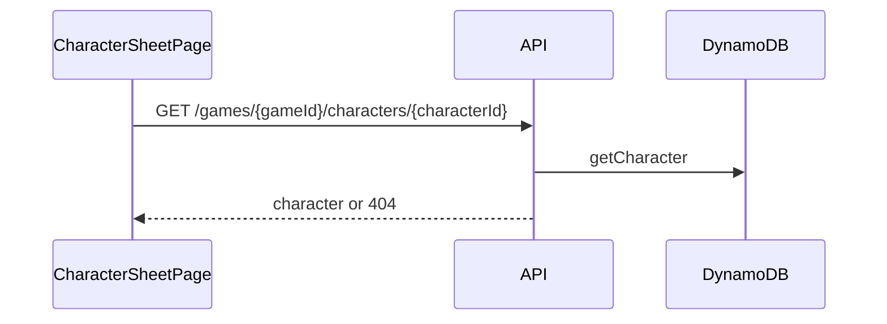
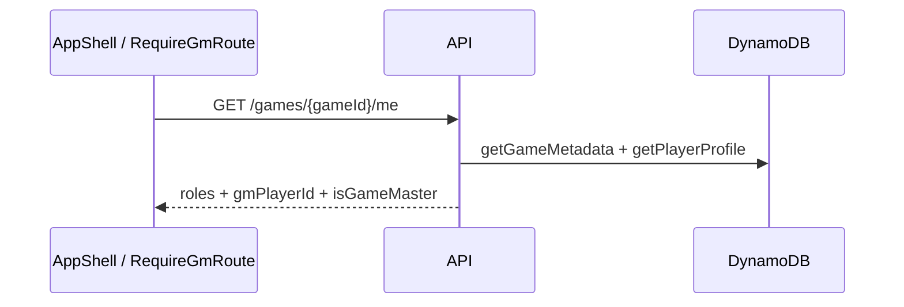
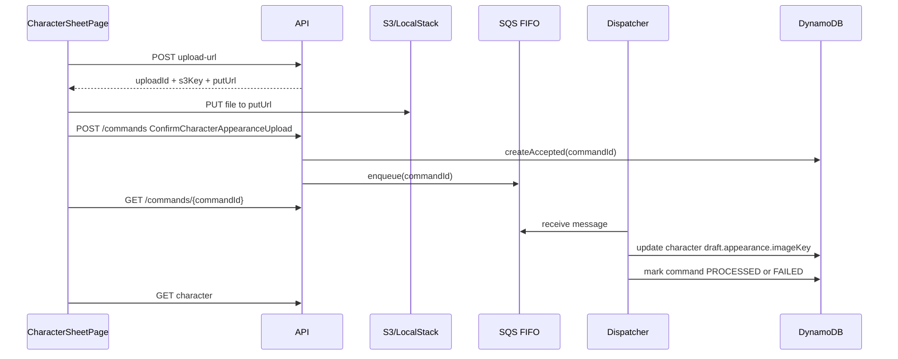
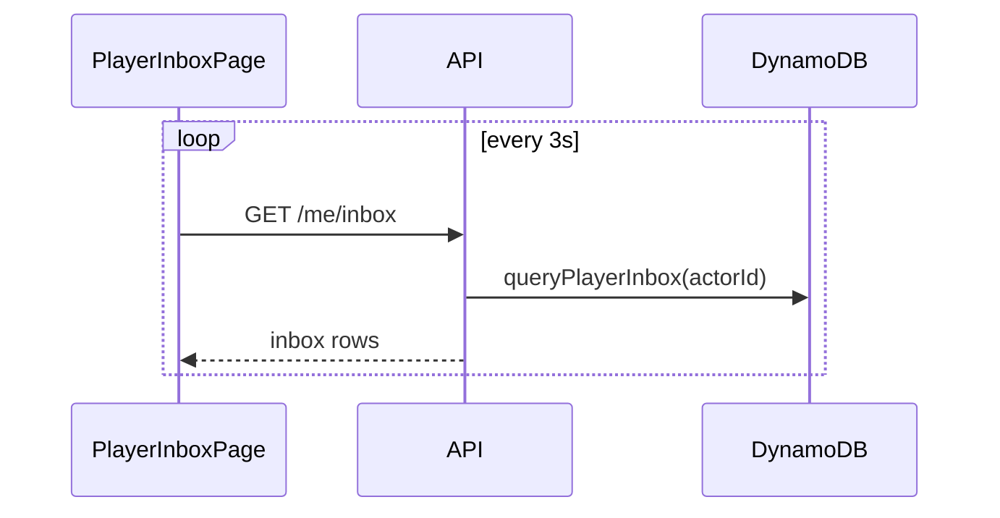
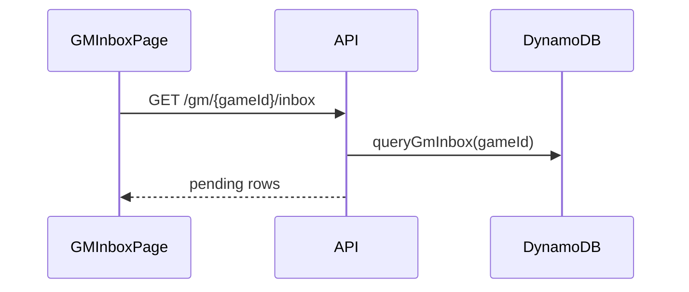
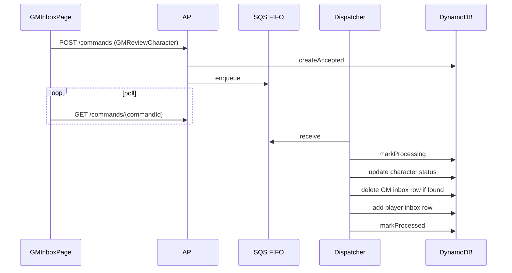

# Debugging Guide: Character Sheet, Appearance, Inbox, And Review

## Character Sheet Read

### Sequence

### Normal Logs

- Web
  - `WEB_CHARACTER_SHEET_LOAD_START`
  - `WEB_API_GET_CHARACTER_REQUEST`
  - `WEB_API_GET_CHARACTER_HIT`
  - `WEB_CHARACTER_SHEET_LOAD_OK`
- API
  - `API_REQUEST_START`
  - `API_GET_CHARACTER_HIT`

### Error Logs

- Web
  - `WEB_CHARACTER_SHEET_LOAD_MISS`
  - `WEB_CHARACTER_SHEET_LOAD_FAILED`
  - `WEB_API_REQUEST_ERROR`
- API
  - `API_GET_CHARACTER_MISS`
  - `API_REQUEST_ERROR`

## Game Actor Context Read

### Sequence

### Normal Logs

- Web
  - `WEB_GAME_ACTOR_CONTEXT_LOAD_START`
  - `WEB_API_GET_GAME_ACTOR_CONTEXT_REQUEST`
  - `WEB_API_GET_GAME_ACTOR_CONTEXT_OK`
  - `WEB_GAME_ACTOR_CONTEXT_LOAD_OK`
- API
  - `API_GET_GAME_ACTOR_CONTEXT`

### Error Logs

- Web
  - `WEB_GAME_ACTOR_CONTEXT_LOAD_FAILED`
  - `WEB_API_REQUEST_ERROR`
- API
  - `API_REQUEST_ERROR`

## Appearance Upload

### Sequence

### Normal Logs

- Web
  - `WEB_CHARACTER_SHEET_UPLOAD_START`
  - `WEB_API_APPEARANCE_UPLOAD_URL_REQUEST`
  - `WEB_API_APPEARANCE_UPLOAD_URL_OK`
  - `WEB_CHARACTER_SHEET_UPLOAD_BINARY_OK`
  - `WEB_API_POST_COMMAND_REQUEST`
  - `WEB_CHARACTER_SHEET_UPLOAD_CONFIRM_ACCEPTED`
  - `WEB_CHARACTER_SHEET_UPLOAD_STATUS_POLLED`
  - `WEB_CHARACTER_SHEET_UPLOAD_OK`
- API
  - `API_APPEARANCE_UPLOAD_URL_ISSUED`
  - `API_APPEARANCE_COMMAND_AUTHORIZED`
  - `API_APPEARANCE_OBJECT_VERIFIED`
  - `API_COMMANDLOG_ACCEPTED` or `API_COMMANDLOG_IDEMPOTENT_REPLAY`
  - `API_ENQUEUED` or `API_ENQUEUE_SKIPPED_REPLAY`
- Dispatcher
  - `DISPATCHER_MESSAGE_RECEIVED`
  - `DISPATCH_BEGIN`
  - `DISPATCH_MARK_PROCESSING`
  - `DISPATCH_HANDLER_EFFECTS`
  - `DISPATCH_APPLY_EFFECTS_OK`
  - `DISPATCHER_MESSAGE_RESULT`
  - `DISPATCHER_MESSAGE_DELETED`

### Error Logs

- Web
  - `WEB_CHARACTER_SHEET_UPLOAD_FAILED`
  - `WEB_API_REQUEST_ERROR`
- API
  - `API_APPEARANCE_UPLOAD_URL_REJECTED`
  - `API_COMMANDLOG_ACCEPT_FAILED`
  - `API_ENQUEUE_FAILED`
  - `API_REQUEST_ERROR`
- Dispatcher
  - `DISPATCH_FAILED`
  - `DISPATCH_MESSAGE_DELETED_AFTER_FAILURE`

### Determinants

- `gameId`
- `characterId`
- `uploadId`
- `s3Key`
- `contentType`
- `fileSizeBytes`

### Important Caveats

- `s3Key` and `commandId` are the primary correlation keys for this flow.
- The API now returns a signed `imageUrl` on character reads from stored `imageKey`; the URL is intentionally short-lived.

## Player Inbox Read

### Sequence

### Normal Logs

- `WEB_PLAYER_INBOX_REFRESH_START`
- `WEB_API_GET_PLAYER_INBOX_REQUEST`
- `WEB_API_GET_PLAYER_INBOX_OK`
- `WEB_PLAYER_INBOX_REFRESH_OK`
- `API_GET_PLAYER_INBOX`

### Error Logs

- `WEB_PLAYER_INBOX_REFRESH_FAILED`
- `WEB_API_REQUEST_ERROR`
- `API_REQUEST_ERROR`

## GM Inbox Read

### Sequence

### Normal Logs

- `WEB_GM_INBOX_REFRESH_START`
- `WEB_API_GET_GM_INBOX_REQUEST`
- `WEB_API_GET_GM_INBOX_OK`
- `WEB_GM_INBOX_REFRESH_OK`
- `WEB_GAME_ACTOR_CONTEXT_LOAD_OK`
- `API_GET_GM_INBOX`

### Error Logs

- `WEB_GM_INBOX_REFRESH_FAILED`
- `WEB_API_REQUEST_ERROR`
- `API_REQUEST_ERROR`

## GM Review

### Sequence

### Normal Logs

- Web
  - `WEB_GM_REVIEW_START`
  - `WEB_GM_REVIEW_ACCEPTED`
  - `WEB_GM_REVIEW_STATUS_POLLED`
  - `WEB_GM_REVIEW_OK`
- API
  - `API_POST_COMMAND_REQUEST`
  - `API_GM_AUTHORIZED`
  - `API_COMMANDLOG_ACCEPTED`
  - `API_ENQUEUED`
- Dispatcher
  - `DISPATCH_BEGIN`
  - `DISPATCH_GM_AUTHORIZED`
  - `DISPATCH_HANDLER_EFFECTS`
  - `DISPATCH_APPLY_EFFECTS_OK`
  - `DISPATCHER_MESSAGE_DELETED`

### Error Logs

- Web
  - `WEB_GM_REVIEW_FAILED`
  - `WEB_GM_REVIEW_REQUEST_FAILED`
  - `WEB_API_REQUEST_ERROR`
- API
  - `API_REQUEST_ERROR`
- Dispatcher
  - `DISPATCH_FAILED`
  - `DISPATCHER_MESSAGE_DELETED_AFTER_FAILURE`

### Determinants

- `decision`
- `gmNotePresent`
- `commandId`
- `characterId`

## Dispatcher Worker Loop

### What Healthy Looks Like

- `DISPATCHER_POLL_START`
- repeated `DISPATCHER_RECEIVE_BATCH`
- for each message:
  - `DISPATCHER_MESSAGE_RECEIVED`
  - `DISPATCHER_MESSAGE_RESULT`
  - `DISPATCHER_MESSAGE_DELETED`

### What Unhealthy Looks Like

- `DISPATCHER_LOOP_ERROR`
- repeated `DISPATCH_FAILED` for the same `commandId` across distinct submissions
- repeated `DISPATCHER_MESSAGE_DELETED_AFTER_FAILURE` with the same root cause

### Interpretation

- Failed messages should now be deleted after the command log is marked `FAILED`.
- `DISPATCHER_MESSAGE_RETAINED_FOR_RETRY` should be rare; if it appears, the worker returned a non-terminal outcome unexpectedly.
- If the same root cause repeats across distinct command submissions, the issue is upstream input or business validation, not queue retry behavior.
